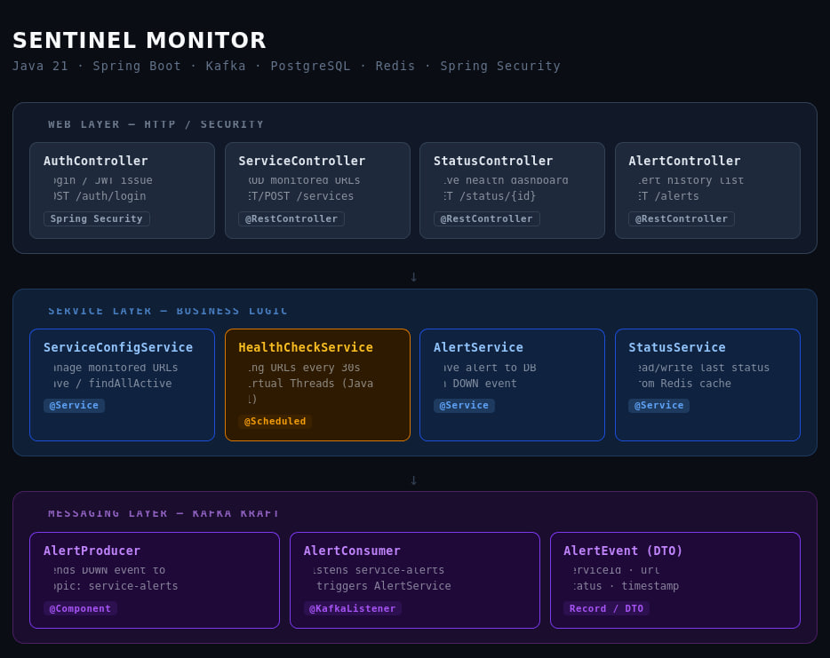
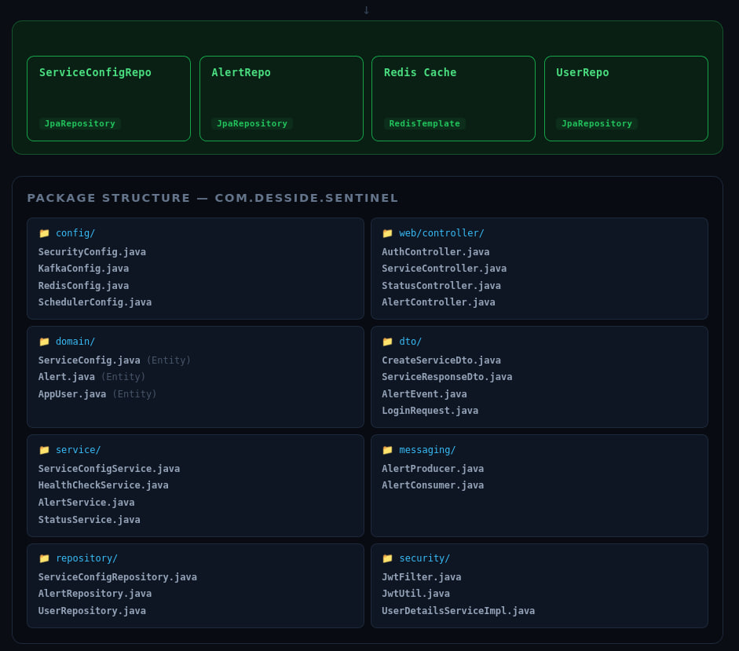
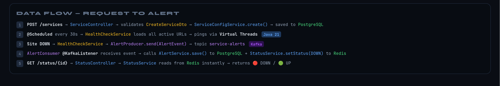

<h1 align="center">sentinel-monitor</h1>

<div align="center">


A distributed microservice-based system for monitoring service health and infrastructure metrics.
Designed for high availability and scalable alerting.

</div>

---



## Overview

**Sentinel Monitor** pings your registered URLs every 30 seconds using Java 21 Virtual Threads, streams DOWN events through Kafka, persists alerts to PostgreSQL, and serves instant UP/DOWN status from Redis cache — all secured behind JWT authentication.

## Architecture



The system is organized into three layers:

**Web Layer** — HTTP / Security

| Component | Role | Endpoint |
|---|---|---|
| `AuthController` | Login & JWT issue | `POST /auth/login` |
| `ServiceController` | Manage monitored URLs | `GET/POST /services` |
| `StatusController` | Live health dashboard | `GET /status/{id}` |
| `AlertController` | Alert history list | `GET /alerts` |

**Service Layer** — Business Logic

| Component | Role | Note |
|---|---|---|
| `ServiceConfigService` | Manage monitored URLs | `save / findAllActive` |
| `HealthCheckService` | Ping URLs every 30s | Virtual Threads (Java 21) |
| `AlertService` | Save alert to DB on DOWN event | `@Service` |
| `StatusService` | Read/write last status | From Redis cache |

> [!NOTE]
> `HealthCheckService` is annotated with `@Scheduled` and runs every 30 seconds. It uses **Java 21 Virtual Threads** to ping all active URLs concurrently without blocking platform threads — no thread pool exhaustion under high load.

**Messaging Layer** — Kafka KRaft

| Component | Role |
|---|---|
| `AlertProducer` | Sends DOWN event to topic `service-alerts` |
| `AlertConsumer` | Listens `service-alerts`, triggers `AlertService` |
| `AlertEvent` (DTO) | `serviceId · url · status · timestamp` |

> [!TIP]
> Kafka runs in **KRaft mode** (no ZooKeeper required). The broker and controller roles are colocated on a single node — perfect for local development and small deployments. For production, consider splitting them across dedicated nodes.

## Data Flow

```
1. POST /services → ServiceController → validates CreateServiceDto
                 → ServiceConfigService.create() → saved to PostgreSQL

2. @Scheduled every 30s → HealthCheckService loads all active URLs
                        → pings via Virtual Threads (Java 21)

3. Site DOWN → HealthCheckService → AlertProducer.send(AlertEvent)
                                 → topic service-alerts  [Kafka]

4. AlertConsumer @KafkaListener receives event
              → AlertService.save() to PostgreSQL
              + StatusService.setStatus(DOWN) to Redis

5. GET /status/{id} → StatusController → StatusService reads from Redis instantly
                   → returns 🔴 DOWN / 🟢 UP
```

## Package Structure

```
com.desside.sentinel
├── config/
│   ├── SecurityConfig.java
│   ├── KafkaConfig.java
│   ├── RedisConfig.java
│   └── SchedulerConfig.java
├── web/controller/
│   ├── AuthController.java
│   ├── ServiceController.java
│   ├── StatusController.java
│   └── AlertController.java
├── domain/
│   ├── ServiceConfig.java     (Entity)
│   ├── Alert.java             (Entity)
│   └── AppUser.java           (Entity)
├── dto/
│   ├── CreateServiceDto.java
│   ├── ServiceResponseDto.java
│   ├── AlertEvent.java
│   └── LoginRequest.java
├── service/
│   ├── ServiceConfigService.java
│   ├── HealthCheckService.java
│   ├── AlertService.java
│   └── StatusService.java
├── messaging/
│   ├── AlertProducer.java
│   └── AlertConsumer.java
├── repository/
│   ├── ServiceConfigRepository.java
│   ├── AlertRepository.java
│   └── UserRepository.java
└── security/
    ├── JwtFilter.java
    ├── JwtUtil.java
    └── UserDetailsServiceImpl.java
```

## Tech Stack

| Technology | Version | Purpose |
|---|---|---|
| Java | 21 | Virtual Threads for concurrent health checks |
| Spring Boot | 4.0.5 | Web, Security, JPA, Kafka, Redis |
| Apache Kafka | 3.9.2 (KRaft) | Real-time alerting pipeline |
| PostgreSQL | 15 | Persistent storage for services, alerts, users |
| Redis | 7 | Fast status cache |
| Spring Security + JWT | — | Authentication & authorization |
| Lombok | — | Boilerplate reduction |

## Getting Started

### Prerequisites

- Docker & Docker Compose
- JDK 21
- Gradle

### 1. Start Infrastructure

```yaml
# docker-compose.yml
services:
  db:
    image: postgres:15-alpine
    container_name: sentinel-db
    environment:
      POSTGRES_USER: user
      POSTGRES_PASSWORD: password
      POSTGRES_DB: sentinel_db
    ports:
      - "5432:5432"
    healthcheck:
      test: ["CMD-SHELL", "pg_isready -U user -d sentinel_db"]
      interval: 10s
      timeout: 5s
      retries: 5

  redis:
    image: redis:7-alpine
    container_name: sentinel-redis
    ports:
      - "6337:6379"

  kafka:
    image: apache/kafka:3.9.2
    container_name: sentinel-kafka
    environment:
      KAFKA_NODE_ID: 1
      KAFKA_PROCESS_ROLES: 'broker,controller'
      KAFKA_CONTROLLER_QUORUM_VOTERS: '1@sentinel-kafka:9093'
      KAFKA_LISTENERS: 'PLAINTEXT://0.0.0.0:9092,CONTROLLER://0.0.0.0:9093'
      KAFKA_ADVERTISED_LISTENERS: 'PLAINTEXT://localhost:9092'
      KAFKA_INTER_BROKER_LISTENER_NAME: 'PLAINTEXT'
      KAFKA_CONTROLLER_LISTENER_NAMES: 'CONTROLLER'
      KAFKA_OFFSETS_TOPIC_REPLICATION_FACTOR: 1
      CLUSTER_ID: '5L6g3nShT-eMCtK--X86sw'
    ports:
      - "9092:9092"

networks:
  default:
    name: sentinel-network
```

```bash
docker compose up -d
```

> [!TIP]
> Wait for the PostgreSQL healthcheck to pass before starting the app. Watch container status with `docker compose ps` — the `db` service must show `healthy` before Spring Boot can apply schema migrations.

### 2. Configure Application

```properties
# application.properties
server.port=8080
server.address=localhost

spring.application.name=sentinel-monitor

spring.jpa.open-in-view=false

# PostgreSQL
spring.datasource.url=jdbc:postgresql://localhost:5432/sentinel_db
spring.datasource.username=user
spring.datasource.password=password
spring.jpa.hibernate.ddl-auto=update

# Redis
spring.data.redis.host=localhost
spring.data.redis.port=6337

# Kafka
spring.kafka.bootstrap-servers=localhost:9092
spring.kafka.consumer.group-id=sentinel-group
spring.kafka.consumer.auto-offset-reset=earliest
spring.kafka.producer.key-serializer=org.apache.kafka.common.serialization.StringSerializer
spring.kafka.producer.value-serializer=org.springframework.kafka.support.serializer.JsonSerializer
spring.kafka.consumer.value-deserializer=org.springframework.kafka.support.serializer.JsonDeserializer
spring.kafka.consumer.properties.spring.json.trusted.packages=com.desside.sentinel.dto

# Scheduler
spring.task.scheduling.pool.size=5
```

> [!NOTE]
> Redis is mapped to host port `6337` (not the default `6379`) to avoid conflicts with a locally running Redis instance. Make sure `spring.data.redis.port=6337` matches your `docker-compose.yml`.

### 3. Build & Run

```bash
./gradlew bootRun
```

The server starts at `http://localhost:8080`.

> [!WARNING]
> `spring.jpa.hibernate.ddl-auto=update` is convenient during development but **must not be used in production**. Switch to `validate` and manage schema migrations with Flyway or Liquibase before deploying.

## API Reference



### Authentication

```http
POST /auth/login
Content-Type: application/json

{
  "username": "admin",
  "password": "secret"
}
```

Returns a JWT token. Include it in all subsequent requests:

```http
Authorization: Bearer <token>
```

> [!NOTE]
> JWT tokens are stateless — there is no server-side invalidation on logout. The only revocation mechanism is token expiry. Set a short expiration window and implement refresh tokens if longer sessions are needed.

### Services

```http
# Register a URL to monitor
POST /services
Content-Type: application/json

{ "url": "https://example.com", "name": "Example" }

# List all monitored services
GET /services
```

### Status & Alerts

```http
# Get current status (reads from Redis — instant)
GET /status/{id}

# Get alert history
GET /alerts
```

> [!TIP]
> `GET /status/{id}` reads exclusively from Redis and returns in sub-millisecond time regardless of database load. This endpoint is safe to poll at high frequency from dashboards or uptime widgets.

## Build

```groovy
// build.gradle
plugins {
    id 'java'
    id 'org.springframework.boot' version '4.0.5'
    id 'io.spring.dependency-management' version '1.1.7'
}

java {
    toolchain {
        languageVersion = JavaLanguageVersion.of(21)
    }
}
```

Key dependencies: `spring-boot-starter-data-jpa`, `spring-boot-starter-kafka`, `spring-boot-starter-security`, `spring-boot-starter-data-redis`, `jjwt 0.12.6`, `lombok`, `postgresql`.

## License

This project is licensed under the [MIT License](LICENSE).
